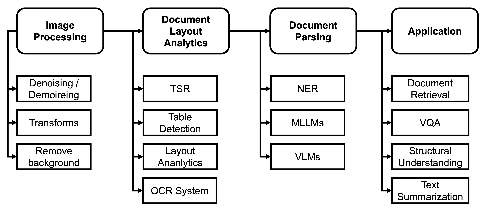
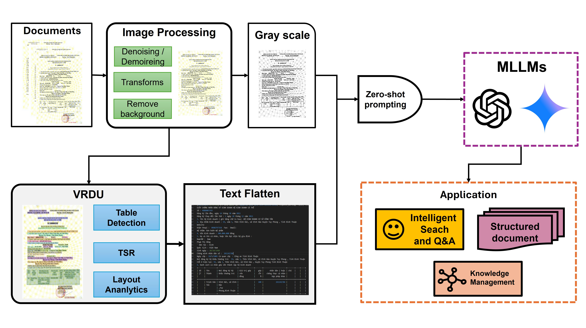
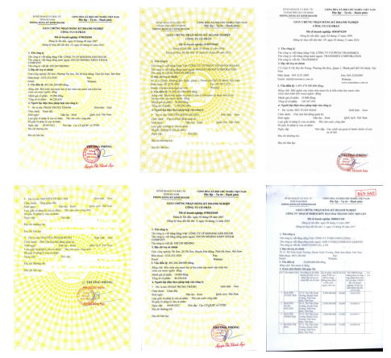
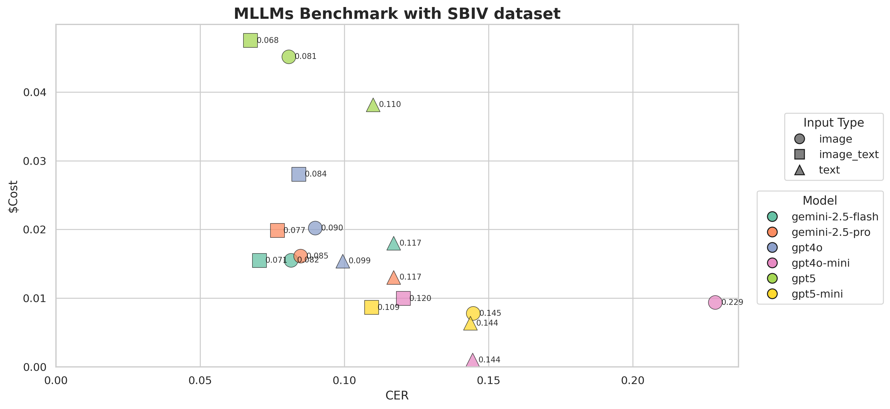

# ViDocParse: Hybrid Multimodal Document Parsing with Layout Awareness

> **Towards Document Parsing in the Wild: Hybrid Multimodal Modeling with Layout Awareness for Multi-Page Understanding**

> Manh Quang Do¹, Ngoc Anh Nguyen²ᐟ³

> ¹Hanoi University of Industry · ²FPT Smart Cloud · ³Banking Academy of Vietnam

## 📰 News

- **[31/07/2026]** Bài báo đã được **chấp nhận (Accepted)** tại **2026 Asia Pacific Signal and Information Processing Association Annual Summit and Conference (APSIPA ASC 2026)**! 🎉

---

## Giới thiệu

Document Parsing (DP) là một bài toán khó, đặc biệt với các tài liệu có cấu trúc đa dạng, nhiều trang, và biến đổi theo ngữ cảnh giữa các trang. Các hệ thống DP hiện đại xử lý tốt cấu trúc văn bản, nhưng việc trích xuất thông tin từ tài liệu nhiều trang, không đồng nhất về cấu trúc vẫn là thách thức lớn. Đồng thời, hiện chưa có bộ dữ liệu công khai nào tại Việt Nam để đánh giá các hệ thống này.

Dự án đề xuất một framework end-to-end tích hợp **Multimodal Large Language Models (MLLMs)** thương mại với **Layout Analysis** để phân tích tài liệu có bố cục đa dạng trong cấu hình **zero-shot prompting**. Nhóm tác giả khảo sát nhiều cấu hình thử nghiệm kết hợp MLLMs với Layout Analysis trên các dạng đầu vào khác nhau (text, image, và kết hợp cả hai).

## Đóng góp chính

1. **ViDocParse** – framework end-to-end tích hợp xử lý ảnh, phân tích bố cục (layout analysis), và MLLMs vào một pipeline thống nhất.
2. **SBIV Dataset** – bộ dữ liệu mới, song ngữ (Việt–Anh), song song đa dạng về loại tài liệu, phục vụ đánh giá bài toán E2E Document Parsing tại Việt Nam.
3. **Đánh giá thực nghiệm toàn diện** – phân tích trade-off giữa chi phí (cost) và độ chính xác trích xuất thông tin (CER) trên nhiều MLLM thương mại (GPT-4o, GPT-4o Mini, GPT-5, GPT-5-mini, Gemini-2.5-Pro, Gemini-2.5-Flash).

## Kiến trúc hệ thống

Pipeline ViDocParse gồm 3 giai đoạn chính:
1. Image Processing and Enhancement
2. Layout Analysis and Structural Understanding
3. Zero-shot MLLM Parsing

## Bộ dữ liệu SBIV

**SBIV** (Structured-Rich Business Invoice Vietnam) gồm:

- **953 ảnh tài liệu** (752 train / 201 test), chủ yếu là hóa đơn, chứng từ doanh nghiệp được chụp bằng scanner hoặc camera.
- **Song ngữ** Việt – Anh.
- **59.124 bounding box** được gán nhãn chi tiết với cấu trúc parsing dạng key-value.
- **39 lớp ngữ nghĩa (semantic classes)**.
- Tỷ lệ chồng lấn bounding box rất thấp (**0.04%**), giúp huấn luyện mô hình hiệu quả hơn.
- Phản ánh điều kiện thực tế: nhiễu, biến đổi ánh sáng, méo hình học, mất cân bằng phân bố nhãn.

So với các bộ dữ liệu hiện có (SROIE, FUNSD, XFUND, CORD, EPHOIE, SIBR), SBIV đa dạng hơn về loại tài liệu, bố cục và điều kiện thu thập (cả scan lẫn camera), đồng thời hỗ trợ đầy đủ tác vụ parsing.

## Kết quả thực nghiệm nổi bật

| Thành phần | Model tốt nhất | Kết quả |
|---|---|---|
| Table Structure Recognition (TSR) | YOLOv11m | mAP@50 = 99.3% |
| Table Detection (TD) | YOLOv12n | mAP@50 = 99.2%, mAP@50:95 = 96.9% |
| Layout Analytics | LayoutLMv2 / LayoutXLM | F1-score > 96% |

Khi benchmark các MLLM thương mại (GPT-4o, GPT-4o Mini, GPT-5, GPT-5-mini, Gemini-2.5-Pro, Gemini-2.5-Flash) trên 3 cấu hình đầu vào (Image-only, Text-only, Image+Text): cấu hình **kết hợp Image + Text (layout-aware)** luôn cho **CER thấp nhất**, khẳng định lợi ích của việc kết hợp thông tin thị giác và biểu diễn văn bản có nhận biết bố cục.

### Tóm tắt benchmark kết hợp (Image + Text) — cấu hình tốt nhất

Bảng dưới tổng hợp kết quả của cấu hình **Image + Text** (cấu hình cho hiệu năng tốt nhất) trên tất cả các MLLM được đánh giá, sắp xếp theo CER tăng dần:

| Model | Cost/doc (USD) | CERtotal |
|---|---|---|
| **GPT-5** | 0.047493 | **0.067503** (thấp nhất) |
| Gemini-2.5-Flash | 0.015494 | 0.070536 |
| Gemini-2.5-Pro | 0.019841 | 0.076818 |
| GPT-4o | 0.028032 | 0.084174 |
| GPT-5-mini | 0.008649 | 0.109465 |
| GPT-4o Mini | 0.009969 | 0.120444 |

**Nhận xét:**

- **GPT-5 (Image+Text)** đạt CER thấp nhất toàn bộ benchmark (0.0675) nhưng cũng có chi phí cao nhất (~0.0475 USD/tài liệu).
- **Gemini-2.5-Flash** cho kết quả cân bằng tốt nhất giữa chi phí và độ chính xác: CER gần tương đương GPT-5 (0.0705) nhưng chi phí chỉ bằng khoảng **1/3** (0.0155 USD/tài liệu) — phù hợp để triển khai thực tế ở quy mô lớn.
- Các mô hình mini (GPT-5-mini, GPT-4o Mini) có chi phí thấp nhất nhưng CER cao hơn đáng kể so với các mô hình full-size, cho thấy sự đánh đổi rõ rệt giữa chi phí và độ chính xác.
- Nhìn chung, cấu hình **Image + Text** luôn vượt trội hơn Image-only hoặc Text-only trên mọi model, khẳng định vai trò của biểu diễn văn bản có nhận biết bố cục (layout-aware) khi kết hợp cùng thông tin thị giác.
